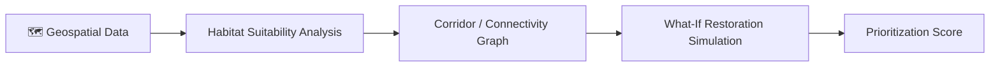
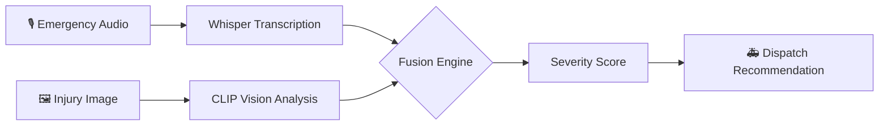

<h1 align="center">Veer Pratap Singh</h1>
<p align="center"><i>Cybersecurity Enthusiast · Full‑Stack Developer · AI Builder</i></p>

```bash
$ whoami
Veer Pratap Singh — B.Tech CSE (3rd Year), Arya College of Engineering, Jaipur

$ cat focus.txt
Cybersecurity | Full-Stack Development | Applied AI

$ echo $MOTTO
"Build systems. Break assumptions. Secure everything."
```

<p align="center">
  <a href="mailto:xyresiiic@gmail.com"></a>
  <a href="https://linkedin.com/in/veer-pratap-singh-77702b316"></a>
  <a href="https://github.com/xyresiiic"></a>
  <a href="https://portfolio-xyresiiic.vercel.app/"></a>
  <a href="https://instagram.com/ivee.rrr"></a>
</p>

<br>

## 🧑‍💻 About

3rd-year CSE student who likes taking things apart to see how they break — then building them back sturdier. Currently splitting time between full-stack web development, applied AI, and the fundamentals of cybersecurity, with a creative practice in photography and design on the side.

- 🔐 Aspiring cybersecurity engineer, currently deepening networking and web-security fundamentals
- 🧠 Building AI-assisted tools — from multimodal triage systems to conservation platforms
- 🚀 Two hackathons, three internships, and a habit of shipping real, working projects
- 📸 Photographer and designer when I'm away from the keyboard

<br>

## 🧰 Tech Stack

**Languages**
<br>


**Web Development**
<br>


**Systems, Tools & Data**
<br>


**Security Fundamentals**
<br>


<br>

## 📊 Skill Proficiency

| Area | Level |
|:--|:--:|
| C / C++ |  |
| Web Development |  |
| Java |  |
| Problem Solving |  |
| Cyber Security |  |

<p align="center"><br>
 →
 →

<br><sub>Build applications → make them intelligent → make them secure</sub>
</p>

<br>

## 🚀 Featured Projects

### 🛰️ WildLink AI
*AI-powered wildlife habitat connectivity & conservation platform*

A conservation-intelligence platform that identifies critical habitat corridors, prioritizes restoration areas, and simulates conservation interventions using GIS and graph-based analysis.



- Interactive GIS-based habitat visualization with corridor analysis
- Graph-based connectivity modeling between habitat patches
- AI/ML-assisted spatial analysis and restoration simulation


<a href="https://github.com/xyresiiic/WildLifeAI"></a>

<br>

### 🚑 AI Triage Pro
*Multimodal emergency dispatch system — 🏆 4th Place, HackNexus 2.0*

Combines speech and vision models to analyze emergency situations and generate intelligent triage recommendations in real time.



- Emergency call transcription via Whisper
- Injury image analysis via CLIP
- Weighted multimodal fusion for severity scoring and dispatch recommendations


<a href="https://github.com/xyresiiic/AI-TRIAGE-PRO-Project-"></a>

<br>

## 💻 Other Projects

| Project | Description | Link |
|:--|:--|:--:|
| 🌐 Personal Portfolio | Modern animated portfolio showcasing projects and creative work | [Visit ↗](https://portfolio-xyresiiic.vercel.app/) |
| 🖥️ Retro OS Portfolio | Retro, OS-themed animated portfolio (vibe-coded) | [Visit ↗](https://os-portfolio-xyresiiic.vercel.app/) |
| 📅 Content Calendar | Smart content scheduling & planning tool for creators and brands | [Visit ↗](https://xyresiiic.github.io/Content-Calandar/) |
| 💎 Lustréva | Luxury gifting concept site — elegant UI and branding | [Visit ↗](https://xyresiiic.github.io/Landinge-page/) |
| 🩺 MedicSoul | Healthcare assistant concept with chatbot-based interaction | [Visit ↗](https://xyresiiic.github.io/madicSoul/) |
| 🧮 Basic Calculator | Responsive calculator built to practice frontend fundamentals | [Visit ↗](https://xyresiiic.github.io/Basic_calculator/) |
| 🧑‍💻 CodSoft Projects | Calculator · To-Do List · Number Guessing Game | [Repo ↗](https://github.com/xyresiiic/CODSOFT) |

<br>

## 🏆 Achievements

| Achievement | Details |
|:--|:--|
| 🥇 HackNexus 2.0 | 4th Place — AI Triage Pro |
| 🛰️ Infinity Hacks 2026 | Wildlife Conservation Track — WildLink AI |
| 🔐 Cyber Security Internship | Triple One Solution — 2 months |
| 💻 Web Development Internship | IBM |
| 🌐 Web Dev + C++ Internship | CodSoft |
| 🧑‍💻 C++ Internship | CodeAlpha |

<br>

## 💼 Experience

| Role | Organization | Duration |
|:--|:--|:--:|
| Cyber Security Intern | Triple One Solution | 2 months |
| Web Development Intern | CodSoft | 1 months |
| C++ Intern | CodeAlpha | 1 months |

**Triple One Solution** — Practical exposure to cybersecurity concepts, security fundamentals, vulnerability analysis, and secure systems.
**CodSoft** — Practical programming and frontend development: Calculator, To-Do List, Number Guessing Game.
**CodeAlpha** — Core C++ programming concepts and applied development tasks.

<br>

## 📜 Certifications

| Certification | Issuer |
|:--|:--|
| Basics of Quadcopter | IIT Roorkee |
| Blockchain Technology | IIT Roorkee |
| Web Development Fundamentals | IBM |
| Virtual Tech Internship | Deloitte |
| Software Engineering Simulation | Accenture |
| Solution Architecture Simulation | AWS |
| GenAI Data Analytics Simulation | Tata |
| Prompt Design in Vertex AI | Google |
| Building Real-World AI Applications with Gemini & Imagen | Google |
| Web Development Internship | CodSoft |
| C++ Internship | CodeAlpha |

<br>

## 📊 GitHub Analytics

<br><br>
<div align="center">


</div><br><br><br>


<div align="center">


</div><br><br><br>


<div align="center">


</div>

## 📸 Beyond Code

Photography, videography, and graphic design fill the time I'm not writing code — the same eye for composition and detail carries over into how I approach interfaces and products. Tools of choice: Photoshop, Lightroom, Canva, and VN.

<br>

## 🎯 2026 Goals


- [x] Strengthen C++ & DSA
- [x] Build real-world projects
- [x] Explore cyber security
- [x] Participate in hackathons
- [ ] Learn networking fundamentals in depth
- [ ] Become industry-ready
- [ ] Build advanced security projects
- [ ] Contribute to open source
- [ ] Land a cyber security role

---

<p align="center"><sub>Always open to conversations about security, AI, and building useful things.</sub></p>
<p align="center">
  
</p>
